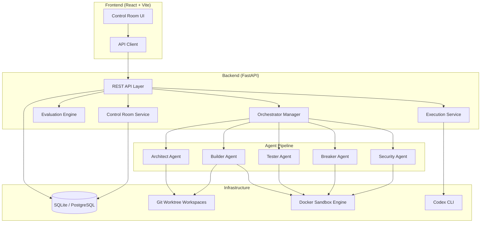
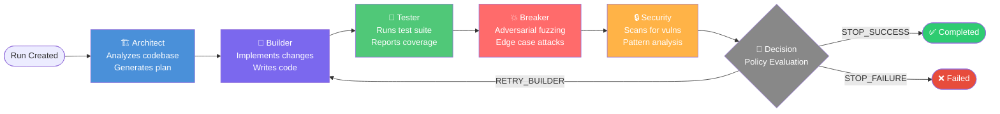
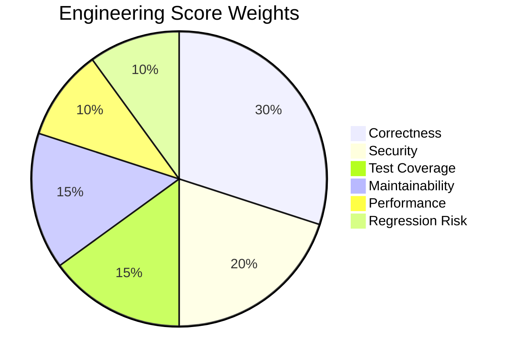
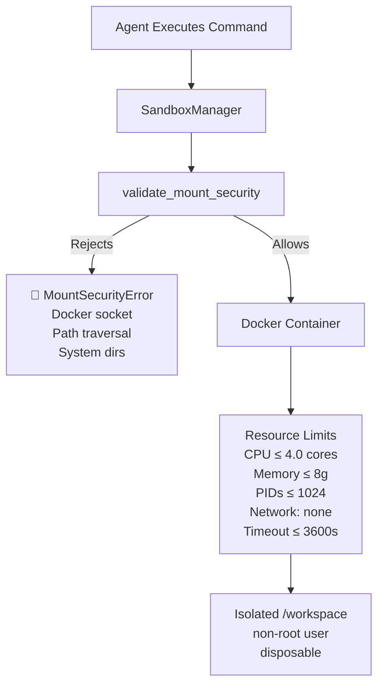
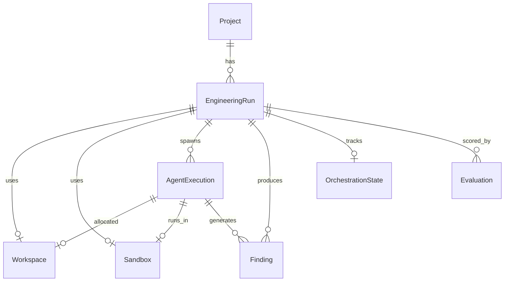

# Codex OS — System Architecture

> **Phase 10: Final Hardening, Demo & Deployment Readiness**

This document describes the complete architecture of Codex OS — the autonomous software engineering sandbox.

---

## System Topology



---

## Agent Pipeline Flow

The orchestrator drives a deterministic multi-iteration pipeline:



---

## Orchestrator Decision Policy

After each iteration, `OrchestratorPolicy.evaluate()` inspects:

| Signal | Threshold | Effect |
|--------|-----------|--------|
| Tester status COMPLETED | — | Positive signal |
| Builder exit code 0 | — | Positive signal |
| Critical security findings | > 0 CRITICAL | → `STOP_FAILURE` |
| High security findings | > 5 HIGH | → `RETRY_BUILDER` |
| Breaker findings | > 10 | → `RETRY_BUILDER` |
| Max iterations reached | iter == max | → `STOP_FAILURE` or `STOP_SUCCESS` |

---

## Evaluation & Engineering Score

The `EvaluationEngine` assigns a 0–100 composite score across 6 weighted dimensions:



Each dimension is scored `0–100` based on evidence extracted from agent outputs. The composite score is:

```
overall_score = Σ (dimension_score × weight) × 100
```

If insufficient evidence exists, the dimension reports `INSUFFICIENT_EVIDENCE` and contributes a penalized score of `30`.

---

## Sandbox Security Model



---

## Git Worktree Isolation

Each agent execution operates in an isolated Git worktree:

```
CODEX_WORKSPACE_ROOT/
  ├── ws-run-1-architect-20240101T120000/   ← Architect worktree
  ├── ws-run-1-builder-20240101T120100/     ← Builder worktree
  ├── ws-run-1-tester-20240101T120200/      ← Tester worktree
  └── ws-run-1-breaker-20240101T120300/     ← Breaker worktree
```

Worktrees are created from the project's `repository_path` base and deleted on completion. This guarantees agents never interfere with each other's in-progress changes.

---

## Database Schema



---

## API Surface (Phase 10)

| Method | Path | Description |
|--------|------|-------------|
| GET | `/api/health` | Health (DB + Docker + Codex status) |
| GET/POST | `/api/projects` | Project CRUD |
| GET/POST | `/api/projects/{id}/runs` | Run management |
| POST | `/api/runs/{id}/execute` | Start Codex execution |
| POST | `/api/runs/{id}/start-autonomous` | Launch orchestrated pipeline |
| GET | `/api/runs/{id}/orchestration` | Orchestration status |
| POST | `/api/runs/{id}/pause\|resume` | Boundary-safe control |
| GET | `/api/runs/{id}/control-room` | Full dashboard snapshot |
| POST | `/api/runs/{id}/evaluate` | Trigger evaluation scoring |
| GET | `/api/runs/{id}/findings` | Security/breaker findings |

---

## Deployment Architecture

```mermaid
graph LR
    USER[Browser] --> NGINX[Nginx :80\nFrontend SPA]
    NGINX --> API[FastAPI :8000\nBackend]
    API --> PG[(PostgreSQL :5432)]
    API --> DOCKER_SOCK[Docker Socket\n/var/run/docker.sock]
    DOCKER_SOCK --> SANDBOX[Isolated Sandbox\nContainers]
    API --> WORKSPACES[/app/workspaces\nGit Worktrees]
```

> ⚠️ **Security Note**: Mounting the Docker socket grants the backend container full control over the host Docker daemon. This is architecturally required for sandbox provisioning and should only be deployed in trusted environments.
